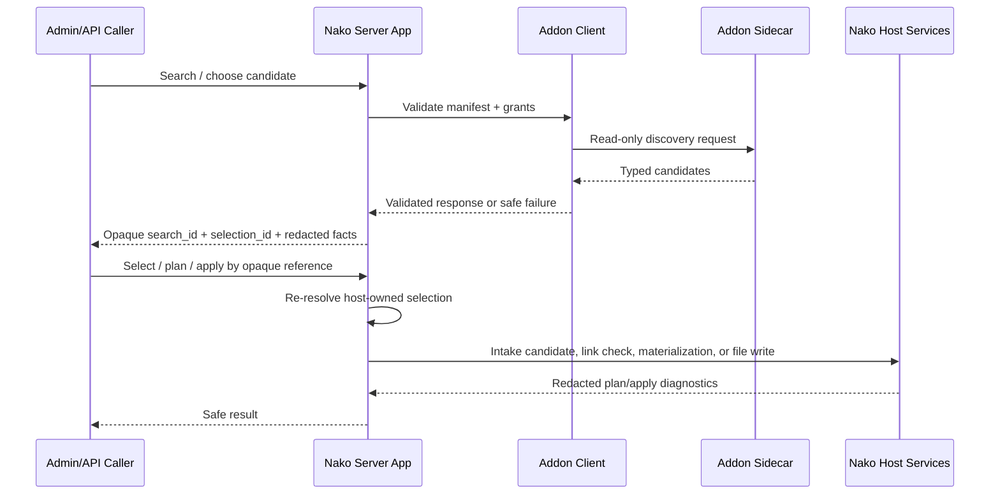

# Host-Owned Addon Resource Flow Pattern Audit

## Scope

This audit compares the existing host-owned flows that turn Addon discovery or
Addon runtime requests into Nako-owned selection, planning, diagnostics, and
side-effect handoff:

- Resource Search product flow in
  `crates/nako-server/src/app/addons/resource_search.rs`.
- Subtitle search, selected reference, import plan, and import apply flow in
  `crates/nako-server/src/app/addons/subtitles.rs`.
- External acquisition action and materialization flow in
  `crates/nako-server/src/app/addons/external_acquisition.rs`.
- Acquisition intake handoff in
  `crates/nako-server/src/app/acquisition_intake.rs` and
  `crates/nako-server/src/app/addons/intake.rs`.
- Admin/API route and DTO surfaces in `crates/nako-server/src/http/addons.rs`
  and `crates/nako-api/src/extension.rs`.

This task is audit-only. It does not propose production changes inside this
task.

## Architectural Baseline

ADR 0003 and ADR 0015 keep Addons as out-of-process HTTP sidecars with explicit
capabilities and scopes. ADR 0020 allows strong Addon side effects only through
Nako-owned APIs, scoped tokens, grants, audit, and host policy. ADR 0050 keeps
resource search read-only and separates link checks, acquisition runner actions,
cloud transfer, and password/code handling. ADR 0051 keeps subtitle import,
target derivation, and library file writes host-owned. ADR 0053 requires
redacted diagnostics and keeps control-plane policy out of one-off feature
helpers.

The Addon Protocol should keep owning permissive wire contracts:

- resource, subtitle, link-check, external acquisition, task, event, runtime,
  side-effect, scope, and validation DTOs;
- stable schema constants and runtime paths;
- redaction-safe `Debug` for protocol values that may carry source refs,
  delivery bodies, runner refs, materialization refs, or tokens.

The Addon Protocol should not own server policy:

- transient Admin selection sessions;
- selected-reference identity generation;
- Admin apply plans or apply result vocabulary;
- grant storage, token lifecycle, accepted permission state;
- host redaction taxonomy beyond protocol-level safe `Debug`;
- durable job, audit, VFS, library file write, or acquisition intake authority.

## Current Flow Map

The important shape is not "Addon returns a URL and the browser resubmits it".
The shape is "Nako keeps a host-owned reference and later performs policy,
planning, and side effects from that reference".

## Flow Comparison

| Flow | Read-only discovery | Host-owned reference | Plan/apply or handoff | Safety behavior |
| --- | --- | --- | --- | --- |
| Resource Search | `search_addon_resources` calls `call_addon_resource_search_with_outcome` and stores a transient session (`resource_search.rs:209`, `:241`, `:265`). | `selection_id` is generated from search/result/link/source URI and maps to a stored `ResourceSearchSelection` (`resource_search.rs:40`, `:51`, `:75`, `:509`, `:599`). | Selection records an acquisition intake candidate (`resource_search.rs:315`, `:353`; `acquisition_intake.rs:316`). Link check sends a selected-link context to a separate Addon resource (`resource_search.rs:373`, `:414`). | Product responses expose `source_ref_redacted`, fingerprints, flags, and `safe_error_code`; raw links are hidden (`resource_search.rs:531`, `:615`, `:625`). Tests assert no raw URL/token/path leaks (`http/tests/addons.rs:8995`, `:9039`). |
| Subtitle Import | `search_addon_subtitles` calls `call_addon_subtitle_search_with_outcome` and stores a transient session (`subtitles.rs:131`, `:161`, `:185`). | `selection_id` maps to a stored `SubtitleSearchSelection`; selection returns `AdminAddonSubtitleSelectedReference` (`subtitles.rs:49`, `:59`, `:90`, `:234`, `:269`). | Plan derives target media source, sidecar filename, language, format, conflict policy, backup policy, and idempotency key (`subtitles.rs:391`, `:457`, `:479`, `:866`). Apply validates the plan key, resolves content, validates text, writes through library file write, and refreshes facts (`subtitles.rs:302`, `:323`, `:336`, `:344`, `:354`). | Responses avoid raw sidecar paths, artifact IDs, backup URIs, and download tokens. Tests assert plan/apply redaction and idempotent replay (`http/tests/addons.rs:8333`, `:8624`, `:8633`). |
| External Acquisition | The action task consumes a protocol `AddonExternalAcquisitionActionRequest`; runtime materialization consumes `AddonExternalAcquisitionMaterializationRequest` (`external_acquisition.rs:37`, `:113`). | Target refs are `SelectedLink`, `IntakeCandidate`, or `RunnerJob`, but materialization only accepts host-owned candidate refs for enqueue materialization (`external_acquisition.rs:165`, `:173`, `:180`, `:217`). | The sidecar can dispatch a task, but raw material is released only through the Nako runtime materialization route after validating token principal, running task, idempotency, audit ref, declaration, operation, and library scope (`external_acquisition.rs:118`, `:130`, `:133`, `:239`, `:276`). | Materialization returns `source_ref_redacted` and blocks unsupported link types. Tests assert raw magnet URI, materialization ref, candidate ID, and idempotency key do not leak (`http/tests/addons.rs:6334`, `:6340`, `:6474`, `:6511`). |

## Findings

### P1: Selection Session Mechanics Are Duplicated

Resource Search and Subtitle Search each define a bespoke in-memory session
store with the same TTL and max-count policy:

- `RESOURCE_SEARCH_SESSION_TTL_MS = 15 * 60 * 1_000` and
  `RESOURCE_SEARCH_SESSION_MAX_COUNT = 64`
  (`resource_search.rs:36`, `:37`).
- `SUBTITLE_SEARCH_SESSION_TTL_MS = 15 * 60 * 1_000` and
  `SUBTITLE_SEARCH_SESSION_MAX_COUNT = 64`
  (`subtitles.rs:43`, `:44`).

Both stores prune by `expires_at_ms`, enforce max count by oldest
`created_at_ms`, and validate `(addon_id, search_id, selection_id)` before
handoff (`resource_search.rs:69`, `:75`, `:96`, `:101`;
`subtitles.rs:84`, `:90`, `:110`, `:115`).

This is strong evidence for a server-local helper, not for a protocol change.
The duplication is currently safe because the tests cover both flows, but the
next Addon resource type would likely copy the same TTL, selection lookup, and
not-found semantics again.

### P1: The Common Product Vocabulary Exists But Is Not Named

The API already repeats the same product concepts:

- `search_id` and `selection_id` for Resource Search and Subtitle Search
  (`extension.rs:899`, `:923`, `:983`, `:1006`).
- selected reference / selected candidate responses
  (`extension.rs:1006`, `:1016`).
- plan/apply shape for host-owned writes (`extension.rs:1091`, `:1104`,
  `:1131`, `:1159`).
- safe call status and `safe_error_code` (`extension.rs:841`, `:899`,
  `:983`, `:1174`).
- redacted source facts (`extension.rs:889`, `:1174`, `:1707`).

The vocabulary is coherent but still resource-specific. Without an internal
pattern, future Addon Manager or Admin UI work may introduce a fourth variant:
for example `candidate_ref`, `selected_resource_id`, or `operation_ref` for
the same host-owned selected-reference idea.

### P1: Redaction Rules Are Correct But Scattered

Reviewed flows avoid raw source refs in product responses and addon context:

- Resource Search uses `source_ref_redacted` and fingerprints for link summaries
  and link-check context (`resource_search.rs:531`, `:615`, `:623`, `:625`).
- Acquisition intake diagnostics store redacted source refs and source-key
  fingerprints (`acquisition_intake.rs:1089`, `:1119`, `:1120`).
- External acquisition materialization returns redacted source facts and
  redacted protocol `Debug` protects materialization refs and target refs
  (`external_acquisition.rs:151`; `nako-addon-protocol/src/lib.rs:907`,
  `:1031`, `:1080`).
- Subtitle protocol `Debug` redacts inline subtitle text and download URLs
  (`nako-addon-protocol/src/lib.rs:1178`, `:1215`, `:1275`).

The issue is not an observed leak. The issue is taxonomy drift: each flow owns
slightly different helper names, safe error code sources, and response facts.

### P1: External Acquisition Is The Strongest Host-Owned Boundary

External acquisition is stricter than a simple "task calls addon" flow. It
requires an action task, direct dispatch policy, aligned idempotency, audit ref,
target operation compatibility, a running run state, and host lookup of the
candidate before materializing raw link data (`external_acquisition.rs:217`,
`:239`, `:276`, `:390`, `:408`).

That makes it the best reference for future side-effect handoffs. A future
resource-flow pattern should treat raw materialization as an explicit host-owned
stage, not as a field returned by a discovery endpoint.

### P2: Admin/Addons Surface Serialization Must Be Explicit

Future Addon Manager work serializes with these surfaces:

- Admin route inventory and generated contract entries for Addons, resource
  flows, tokens, grants, task runs, install guide, and manager plan
  (`admin_contract.rs:44`, `:52`, `:54`, `:57`, `:61`, `:63`, `:66`, `:70`,
  `:74`, `:246`, `:258`, `:270`).
- Server Addon routes for resource search, subtitle import, task runs, tokens,
  grants, install guide, and manager plan (`http/addons.rs:101`, `:113`,
  `:117`, `:125`, `:129`, `:133`, `:137`, `:141`, `:145`, `:149`, `:153`,
  `:157`, `:169`).
- `apps/admin-web` Addons route and redaction tests, plus legacy `web` Admin
  Plugins status mutation surface. Parent audit already flags this as a drift
  risk.

The first resource-flow implementation follow-on should avoid Admin route or
DTO churn unless one lane explicitly owns the Addon Manager/Admin contract.

## Recommended Server-Local Pattern

Name the pattern **Host-Owned Addon Resource Flow** and keep it inside
`nako-server` first.

Required internal vocabulary:

- **Discovery call**: a bounded Addon call that returns read-only candidates.
- **Selection session**: short-lived host memory keyed by `search_id`, with
  `addon_id`, `manifest_id`, `created_at_ms`, `expires_at_ms`, and typed
  selections.
- **Selected reference**: an opaque Admin-visible reference, usually
  `selection_id`, that is resolvable only by the host session or durable host
  record.
- **Selected snapshot**: the subset of Addon candidate data the host retains for
  later planning, with raw material retained only when needed by the host.
- **Apply plan**: host-derived, idempotency-keyed description of what would
  happen and why it is ready or blocked.
- **Apply result**: host-produced result that reports write status, replay,
  safe facts, and redacted diagnostics.
- **Materialization request**: runtime request that releases raw action material
  only after the host validates task, token, operation, audit, idempotency, and
  library context.
- **Safe diagnostic**: lower-snake safe error code plus optional redacted facts;
  no raw path, token, source URI, sidecar URL, provider body, idempotency key,
  materialization ref, candidate ID, or bearer credential.

Recommended internal extraction target:

1. `crates/nako-server/src/app/addons/resource_flow.rs`
2. A generic transient `SelectionSessionStore<TSelection, THandoff>` helper
   with TTL/max-count policy and common addon/search/selection validation.
3. A small `SelectedReferenceContext` / `RedactedSourceFacts` helper for
   consistent `source_ref_redacted`, fingerprint, result/candidate fingerprint,
   and `selection_id` context generation.
4. Shared tests proving Resource Search and Subtitle Search keep the same
   observable API while using the shared session mechanics.

Do not move this into `nako-addon-protocol` until there is evidence that addon
authors need a portable host-session abstraction. Today they do not: sidecars
see protocol request/response DTOs, not Admin selection sessions.

## Alternatives Considered

### Option A: Server-local resource-flow helper (recommended)

Pros:

- Removes duplicated TTL/max-count/session lookup mechanics.
- Keeps host policy close to Nako grants, Admin routes, VFS, task runtime, and
  acquisition intake.
- Avoids Addon Protocol churn.
- Can be introduced without changing public DTOs.

Cons:

- Requires careful generic design so the helper does not hide resource-specific
  semantics like subtitle language/format validation.
- Does not itself solve Addon task/event policy convergence.

Decision: recommended as the first bounded follow-on.

### Option B: Push selected-reference and apply-plan concepts into
`nako-addon-protocol`

Pros:

- Gives addon authors a single vocabulary for selected references.
- Could make external SDK documentation look more uniform.

Cons:

- Moves host Admin/session/apply policy into the permissive wire-contract crate.
- Risks implying Addons can create or validate host selections themselves.
- Conflicts with ADR 0050 and ADR 0051, which keep side effects and target
  derivation host-owned.

Decision: reject.

### Option C: Leave each flow bespoke until Addon Manager ships

Pros:

- Zero immediate refactor risk.
- Lets product decisions settle before naming the abstraction.

Cons:

- The duplication already appears in at least two session stores and three
  handoff paths.
- Addon Manager would likely cement another vocabulary variant in Admin/API.
- Redaction and safe error drift becomes harder to audit.

Decision: acceptable only as a short defer if Addon Manager has to ship first;
not recommended as the architecture direction.

## Safe Diagnostics And Redaction Requirements

Every host-owned Addon resource flow must guarantee:

- Product responses and Admin diagnostics never expose raw source URIs,
  passwords/access codes, bearer tokens, addon tokens, provider secrets,
  private sidecar base URLs, local paths, materialization refs, idempotency
  keys, or candidate IDs when those IDs grant access to raw material.
- Addon context may include `selection_id`, `link_type`, safe display source,
  redacted source ref, and fingerprints, but not raw source URI or user secrets.
- `safe_error_code` values use stable lower-snake vocabulary and must not embed
  raw provider text.
- `safe_facts` must be positive, bounded, and redacted; raw provider payloads
  and raw downloader/materialization output stay out.
- Protocol `Debug` implementations remain redaction-safe for values that may
  carry delivery text, download URLs, runner refs, materialization refs, or
  target refs.
- Apply plans and apply results should report host decisions (`ready`,
  `blocked`, `already_applied`, `target_existed`, `writes_library`,
  `backup_created`) instead of exposing raw filesystem or provider detail.

## Product Decisions Blocking Addon Manager

- Which Admin surface is authoritative for Addon Manager: `apps/admin-web` or
  legacy `web`?
- Will future Addon Manager expose resource-search/subtitle/external
  acquisition flows as one common "Addon resources" workflow, or keep them as
  feature-specific pages?
- Does the first Addon Manager own tokens/grants/health/install-guide only, or
  does it also launch resource flows and task runs?
- Should selected references remain transient for Admin workflows, or should
  some references become durable records before Addon Manager exposes queueable
  actions?
- What is the operator-visible audit model for external acquisition actions:
  task run only, acquisition intake candidate, or both?
- Should cloud-drive transfer and password/code references use the same
  materialization shape as external acquisition, or get a stricter secret
  reference model first?

## First Follow-On Recommendation

Open a bounded implementation task:

**`server-local-addon-resource-flow-session-helper`**

Scope:

- Add a server-local helper module for transient selection sessions and redacted
  selected-reference context.
- Refactor Resource Search and Subtitle Search session stores to use it.
- Preserve existing Admin/API DTOs, route paths, response shapes, and tests.
- Do not touch `nako-addon-protocol`, generated Admin route inventory, or Admin
  Web in the first slice.

Quality gates:

- Focused server tests for Resource Search selection/link-check and Subtitle
  selected-reference/import plan/apply.
- Existing redaction tests must keep passing.
- `git diff --check`.

Success criteria:

| Metric | Current | Target |
| --- | --- | --- |
| Bespoke transient session stores for Addon resource flows | 2 | 0 or 1 shared helper |
| Public protocol/DTO changes in first slice | N/A | 0 |
| Redaction regressions | 0 observed | 0 after refactor |
| Resource-specific plan/apply behavior hidden by abstraction | N/A | 0; stays in resource modules |

## Task/Event Policy Follow-On

Addon task/event execution policy should remain a separate follow-on. External
acquisition shows the strongest current side-effect handoff, but direct
dispatch, sidecar-claim task runs, and event delivery still need one policy
language for retry, cancellation, resource class, trace identity, redacted
output, and operator diagnostics. Combining that with the resource-flow session
helper would make the first follow-on too broad.
