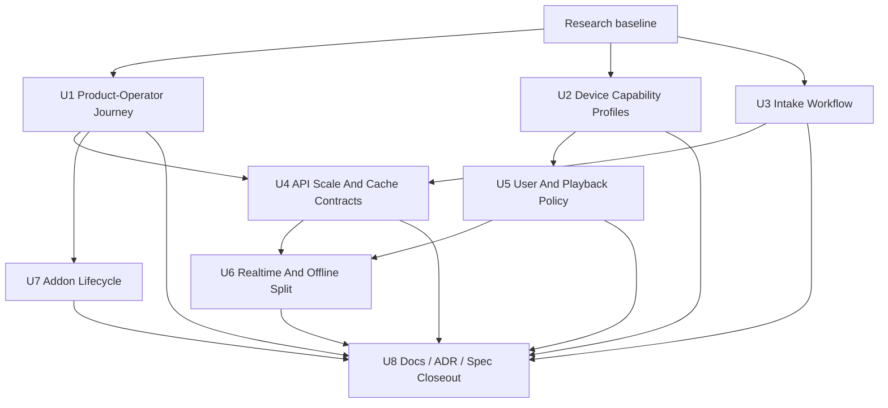
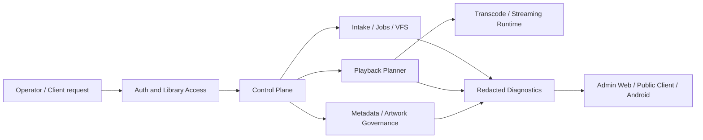

# feat: Close Nako media-server maturity gaps

## Summary

Close the highest-leverage gaps between Nako and mature self-hosted media servers by turning existing backend seams into user-visible product workflows. The plan prioritizes Product-Operator readiness, playback explainability, reliable intake, API scale, access policy, realtime/offline foundations, and Addon lifecycle without copying Jellyfin internals or adopting Plex-style central services.

---

## Problem Frame

The research shows Nako already has strong backend Modules: VFS, metadata governance, playback/transcode planning, durable jobs, Addons, Admin API, Public Client contracts, Admin Web, and Android foundations. The maturity gap is product closure across those Modules: users need a coherent path to configure a Media Library, scan, identify, browse, play, diagnose, repair, govern access, use clients, and recover data.

Jellyfin validates broad self-hosted capability expectations: library scanning, metadata/NFO/local artwork, plugin lifecycle, users, playback, transcoding, devices, Live TV, scheduled tasks, clients, and Admin operations. Plex validates the product journey expectations: setup, remote access, Direct Play/Direct Stream/Transcode explanations, Downloads, Media Optimizer, dashboard, sharing, and broad clients. Nako should borrow the capability lessons while preserving its own domain language and ADR decisions.

---

## Requirements

**Operator journey**

- R1. A new operator can assess setup, Media Library scan readiness, playback readiness, repair pressure, remote access posture, and backup readiness through one product workflow.
- R2. Product readiness must be backed by route and app-level tests rather than only by documentation.

**Playback maturity**

- R3. Client capability profiles must carry codec, container, subtitle, HDR, audio, network, and renderer facts into Playback Source Selection.
- R4. Public Client and Admin surfaces must expose redaction-safe compatibility reasons for Direct Play, Remux, Transcode, and Denied outcomes.

**Library reliability**

- R5. Watcher/debounce, stable-candidate intake, scan admission, source hash triggering, duplicate suggestion, and repair diagnostics must behave as one intake workflow.
- R6. Large-library browse/search/artwork/Admin list surfaces must have bounded pagination, projection, cache, and access-filter contracts.

**Users and clients**

- R7. Single-Admin Mode must not harden into the product identity; User, Role, Library Access, Playback Permission Policy, and User Playback State must support household and parental-control follow-ons.
- R8. Client realtime updates and offline/optimized artifacts must be designed as separate Modules: realtime is principal-filtered state freshness, while offline artifacts are durable Nako-Managed Artifacts.

**Extensibility and constraints**

- R9. Addon lifecycle work must keep Addons out-of-process through Addon Sidecars, scoped Addon Tokens, Library-Scoped Addon Grants, and host-owned side-effect APIs.
- R10. The plan must not introduce Jellyfin Plugin Compatibility, native in-process plugin ABI, Plex-style central accounts, default first-party relay, or copied reference code.

---

## Key Technical Decisions

- KTD1. Productize existing seams before adding broad feature categories: the next maturity gains come from closing the operator/client loops around existing Modules, not from starting Live TV, marketplace, or wide media-domain breadth.
- KTD2. Keep Product-Operator Journey first: it aligns with the current M1 release convergence and exercises scan, metadata, playback, storage, jobs, Admin Web, deployment, and backup evidence without violating ADRs.
- KTD3. Treat capability profiles as a public contract and planner input: playback reasons need the same facts in Public Client API, Admin diagnostics, Android, future Media Web, and server planner tests.
- KTD4. Keep intake behind the control plane: watcher events, scan jobs, source hash jobs, and repair pressure compete for storage and runtime resources, so the workflow must carry resource class, retry, cancellation, and redacted diagnostics.
- KTD5. Separate realtime from offline artifacts: client freshness and durable downloads have different lifecycles, access filters, quotas, and recovery semantics.
- KTD6. Keep Addon lifecycle sidecar-first: install guides, health, config, token rotation, and diagnostics can improve the Jellyfin-like experience without weakening the Addon Protocol seam.
- KTD7. Preserve reference-code discipline: Jellyfin is architecture reference only; Plex is product reference only.

---

## High-Level Technical Design

---

## Scope Boundaries

### In Scope

- Product-Operator readiness and M1 smoke closure.
- Device capability profiles and compatibility reasons.
- Watcher/intake/scheduler productization.
- API scale/cache contract foundations.
- User, Library Access, Playback Permission Policy, and session policy deepening.
- Realtime gateway and offline artifact design split.
- Addon lifecycle productization that preserves sidecar isolation.

### Deferred to Follow-Up Work

- Live TV/DVR.
- Watch Together / SyncPlay.
- Broad TV client and game-console ecosystem.
- Remote transcode workers.
- Marketplace-grade Addon install/update automation.
- Non-video Media Domain parity for music, photos, books, documents, and online catalogs.

### Outside This Product's Identity

- Plex-style central account requirement for local server login.
- Subscription-gated local or remote playback.
- Default first-party traffic relay.
- Jellyfin Plugin Compatibility.
- Native in-process plugin ABI.
- Addon direct database, filesystem, or storage mutation.

---

## Implementation Units

### U1. Product-Operator Journey Readiness

- **Goal:** Build one operator-facing workflow for setup, library scan, playback readiness, repair pressure, remote access, and backup posture.
- **Requirements:** R1, R2, R10.
- **Dependencies:** None.
- **Files:** `docs/ROADMAP.md`, `docs/deployment/M1_LADDER_EVIDENCE_MATRIX.md`, `docs/architecture/M1_ADMIN_DIAGNOSTICS_REPAIR_COVERAGE.md`, `crates/nako-server/src/app/startup.rs`, `crates/nako-server/src/app/library.rs`, `crates/nako-server/src/http/admin.rs`, `crates/nako-server/src/http/tests/admin_route_inventory.rs`, `apps/admin-web/src/features/overview/OverviewPage.tsx`, `apps/admin-web/src/features/libraries/LibrariesPage.tsx`, `apps/admin-web/src/App.test.tsx`.
- **Approach:** Add or deepen a readiness read model that aggregates existing safe facts rather than duplicating feature logic. Keep raw paths, Source Locators, provider payloads, FFmpeg commands, and tokens out of responses.
- **Patterns to follow:** Admin overview route redaction tests, M1 ladder evidence matrix, `docs/architecture/CONTROL_PLANE.md`, `docs/architecture/OPERATIONS_RELEASE.md`.
- **Test scenarios:**
  - A clean local install with auth configured returns setup, scan, playback, storage, network, and backup readiness facts without raw local paths.
  - A Media Library with failed scan work reports actionable repair pressure and links to existing Admin Jobs or storage repair surfaces.
  - A playback dependency failure reports a safe readiness reason without echoing FFmpeg command lines or host paths.
  - Admin Web renders live readiness facts and shows no fake mutation controls when the Admin API is unavailable.
- **Verification:** The operator journey smoke can prove the M1 path without scanning unrelated historical workstreams.

### U2. Device Capability Profiles And Playback Reasons

- **Goal:** Make playback decisions explainable from explicit client/device facts across browser, Android, renderer, and future TV clients.
- **Requirements:** R3, R4, R10.
- **Dependencies:** U1 for readiness surfacing where useful.
- **Files:** `crates/nako-playback/src/capability.rs`, `crates/nako-playback/src/lib.rs`, `crates/nako-client-protocol/src`, `crates/nako-api/src`, `crates/nako-server/src/app/playback`, `crates/nako-server/src/http/playback.rs`, `crates/nako-server/src/http/tests/playback.rs`, `apps/android/app/src/main/java/dev/nako/android/playback`, `apps/android/app/src/test/java/dev/nako/android/playback`.
- **Approach:** Treat capability profiles as the Interface shared by clients, planner, and diagnostics. Add compatibility reasons that explain Direct Play, Remux, Transcode, Denied, selected streams, subtitle handling, HDR/audio requirements, and fallback causes.
- **Patterns to follow:** ADR 0038, ADR 0044, `docs/architecture/PLAYBACK.md`, existing playback route redaction tests.
- **Test scenarios:**
  - A browser capability profile that lacks a source video codec produces a Transcode decision with a redaction-safe reason.
  - A client that supports container but not audio codec produces Remux or audio Transcode according to policy.
  - A selected ASS subtitle on a sidecar-incapable client produces burn-in intent where current policy supports it.
  - Android maps local playback preferences into the public capability DTO without exposing device-local secrets.
- **Verification:** Playback planner tests, HTTP route contract tests, and Android adapter tests agree on the same reason vocabulary.

### U3. Watcher / Intake / Scheduler Productization

- **Goal:** Turn stable-candidate observation, scan admission, source hash triggering, duplicate suggestion, and repair diagnostics into one intake workflow.
- **Requirements:** R5, R10.
- **Dependencies:** U1 for operator readiness; can proceed independently for backend behavior.
- **Files:** `crates/nako-library/src/intake.rs`, `crates/nako-library/src/ingestion.rs`, `crates/nako-library/src/source_hash.rs`, `crates/nako-server/src/app/watch_folder_runtime.rs`, `crates/nako-server/src/app/jobs.rs`, `crates/nako-server/src/app/source_hash.rs`, `crates/nako-server/src/app/storage.rs`, `crates/nako-server/src/http/admin.rs`, `crates/nako-server/src/app/tests/library.rs`, `crates/nako-server/src/app/tests/source_hash.rs`, `crates/nako-server/src/app/tests/storage.rs`.
- **Approach:** Keep watcher observations lightweight until stability is proven, then enqueue resource-admitted durable work. Source hash and VFS repair remain explicit jobs with safe inputs.
- **Patterns to follow:** ADR 0005, ADR 0006, ADR 0012, ADR 0053, `.trellis/spec/nako-server/backend/source-fingerprint-hash-policy.md`.
- **Test scenarios:**
  - A file observed once remains inspecting and does not trigger probe or metadata work.
  - A stable repeated observation enqueues one scan path and avoids duplicate jobs on repeated watch events.
  - A committed source with full-hash escalation enqueues a safe source hash job without storing raw locators.
  - A failed VFS cache target appears in repair diagnostics without exposing backend URLs or credentials.
- **Verification:** Large-file copy and remote-storage simulation tests prove work is admitted only after stable evidence.

### U4. API Scale And Cache Contracts

- **Goal:** Make browse, search, artwork, playback artifacts, and Admin list surfaces safe for large libraries and multiple principals.
- **Requirements:** R6, R10.
- **Dependencies:** U1, U2, U3 provide the first high-value surfaces to enforce.
- **Files:** `docs/architecture/CONTROL_PLANE.md`, `crates/nako-client-protocol/src`, `crates/nako-api/src`, `crates/nako-server/src/http/catalog.rs`, `crates/nako-server/src/app/catalog.rs`, `crates/nako-db/src/accessible_search.rs`, `crates/nako-db/src/search_tests.rs`, `apps/android/app/src/main/java/dev/nako/android/browse`, `apps/android/app/src/test/java/dev/nako/android/browse`.
- **Approach:** Define bounded response budgets, projection-backed reads, access-filtered cache validators, and list/query regression tests before adding more public route breadth.
- **Patterns to follow:** ADR 0023, ADR 0027, ADR 0053, `docs/architecture/STATE_ACCESS.md`, selected artwork ETag tests.
- **Test scenarios:**
  - Catalog browse returns bounded pages with stable ordering and no raw database-column filter exposure.
  - Search projection tests prove no route returns items outside Library Access.
  - Selected artwork cache validators respect auth and library access before returning `304 Not Modified`.
  - Android browse handles paginated responses without assuming total-count availability.
- **Verification:** Public route and DB contract tests cover pagination, redaction, access filtering, and query shape.

### U5. User / Household / Playback Policy Deepening

- **Goal:** Preserve Single-Admin Mode for M1 while deepening the policy Module needed for managed profiles, parental controls, session limits, and playback-cost control.
- **Requirements:** R7, R4, R10.
- **Dependencies:** U2 for capability-aware playback policy; U4 for access-safe list contracts.
- **Files:** `crates/nako-core/src/identity.rs`, `crates/nako-core/src/playback_policy.rs`, `crates/nako-core/src/user_playback.rs`, `crates/nako-server/src/app/access.rs`, `crates/nako-server/src/app/user_playback.rs`, `crates/nako-server/src/app/playback/selection.rs`, `crates/nako-server/src/http/user_playback.rs`, `apps/admin-web/src/features/access/AccessPage.tsx`, `apps/android/app/src/main/java/dev/nako/android/userplayback`.
- **Approach:** Add policy records and read surfaces before broad sharing UX. Policy must run before expensive VFS, staging, or FFmpeg work.
- **Patterns to follow:** ADR 0028, ADR 0037, ADR 0039, `docs/architecture/STATE_ACCESS.md`.
- **Test scenarios:**
  - A user without Library Access cannot browse, request playback, or validate an existing playback ticket for that library.
  - A policy denying remote transcode rejects before staging or FFmpeg startup.
  - Playback progress updates use `/users/me` semantics and do not expose internal principal IDs.
  - Admin Access renders current Single-Admin constraints without implying permanent single-user design.
- **Verification:** Access checks are enforced in app services and route tests prove protected surfaces cannot bypass them.

### U6. Realtime Gateway And Offline Artifact Split

- **Goal:** Establish separate Modules for principal-filtered realtime client updates and durable offline/optimized artifacts.
- **Requirements:** R8, R6, R10.
- **Dependencies:** U2 for playback capability/reason facts, U4 for cache/access contracts, U5 for principal filtering.
- **Files:** `docs/architecture/REALTIME_SYNC.md`, `docs/architecture/CONTROL_PLANE.md`, `crates/nako-events/src/lib.rs`, `crates/nako-core/src/event.rs`, `crates/nako-core/src/job.rs`, `crates/nako-server/src/app/playback_artifact_cleanup.rs`, `crates/nako-server/src/app/playback`, `crates/nako-server/src/http.rs`, `crates/nako-server/src/http/tests/mod.rs`.
- **Approach:** Start with realtime event vocabulary and filtering decisions, then define offline/optimized artifact identity separately from transient HLS session output.
- **Patterns to follow:** ADR 0014, ADR 0052, ADR 0053, `docs/architecture/REALTIME_SYNC.md`.
- **Test scenarios:**
  - A scan or playback update visible to one principal is not emitted to a principal without Library Access.
  - A disconnected client can recover state through REST reads after missing realtime updates.
  - An offline artifact plan does not point at transient HLS session directories.
  - Artifact expiry and access revocation are represented in the plan before any byte-serving route exists.
- **Verification:** Realtime and offline artifacts have different lifecycle tests and do not share mutable state.

### U7. Addon Lifecycle Productization

- **Goal:** Improve Jellyfin-like Addon experience through discovery, install guide, health, configuration, token rotation, and diagnostics while preserving Addon Sidecars.
- **Requirements:** R9, R10.
- **Dependencies:** U1 for operator visibility; U4 for Admin/API scale when catalog pages grow.
- **Files:** `crates/nako-addon-protocol/src/lib.rs`, `crates/nako-addon-client/src/lib.rs`, `crates/nako-official-addon-catalog/src/lib.rs`, `crates/nako-server/src/app/addons`, `crates/nako-server/src/http/addons.rs`, `apps/admin-web/src/features/addons/AddonsPage.tsx`, `docs/adr/0020-jellyfin-like-sidecar-addons-with-scoped-api-access.md`, `docs/guides/ADDON_AUTHOR_GUIDE.md`.
- **Approach:** Add lifecycle facts around the existing Addon Protocol instead of introducing in-process plugins. Keep install/update/process supervision as explicit follow-ons unless the first slice is only generating safe install guidance and health checks.
- **Patterns to follow:** ADR 0003, ADR 0015, ADR 0020, ADR 0033, ADR 0034, ADR 0053.
- **Test scenarios:**
  - An Addon registration displays protocol version, sidecar health, accepted grants, and token rotation status without admin tokens.
  - An Official Addon Catalog descriptor can generate an install guide without starting a process.
  - A hosted page entry point is rendered without receiving Nako admin credentials.
  - Revoked or rotated Addon Tokens cannot continue mutating metadata or library files.
- **Verification:** Addon lifecycle tests prove sidecar isolation, grant enforcement, and redacted diagnostics.

### U8. Documentation, ADR, And Spec Closeout

- **Goal:** Keep architecture documents, Trellis specs, and release evidence aligned with whichever work units ship first.
- **Requirements:** R1-R10.
- **Dependencies:** Runs after each implemented unit.
- **Files:** `CONTEXT.md`, `docs/ARCHITECTURE.md`, `docs/ROADMAP.md`, `docs/architecture/PLAYBACK.md`, `docs/architecture/LIBRARY_PIPELINE.md`, `docs/architecture/CONTROL_PLANE.md`, `docs/architecture/STATE_ACCESS.md`, `docs/architecture/REALTIME_SYNC.md`, `docs/architecture/OPERATIONS_RELEASE.md`, `.trellis/spec`.
- **Approach:** Update durable docs only when a unit changes a public API shape, cross-crate contract, storage/schema behavior, resource policy, or product vocabulary.
- **Patterns to follow:** AGENTS.md, ADR 0053, Trellis finish/update-spec workflow.
- **Test scenarios:** Test expectation: none -- this unit is documentation/spec alignment, with verification through review and existing gates from the code-bearing units.
- **Verification:** Docs do not claim mature capability before the corresponding code and tests exist.

---

## System-Wide Impact

This roadmap affects the entire media-server stack. Playback decisions become more explainable to clients and Admin surfaces. Scan and intake work becomes more observable and resource-admitted. API scale contracts affect public clients, Android, Admin Web, and future Media Web. User/access policy moves closer to a multi-user model. Addon lifecycle improves without weakening the out-of-process trust boundary.

---

## Risks And Dependencies

| Risk | Impact | Mitigation |
| --- | --- | --- |
| The plan becomes a giant unreviewable implementation wave | High | Treat U1 as first recommended slice and open separate Trellis tasks for later units. |
| Product UI work outruns backend contracts | High | Require route/app/contract tests before Admin Web or Android UX claims maturity. |
| Playback capability vocabulary hardens too early | Medium | Start with supported browser/Android facts and keep unknown capability states explicit. |
| Realtime and offline artifact work accidentally reuses transient playback state | High | Keep U6 split into separate Modules and tests. |
| Addon lifecycle work drifts toward native plugin compatibility | High | Keep ADR 0020 and Addon Protocol constraints in every Addon unit. |
| Large-library API scale remains theoretical | Medium | Add query-shape and bounded-response tests when U4 touches routes. |

---

## Acceptance Examples

- AE1. Given a new local install, when an admin opens the operator readiness view, then Nako shows configured auth, library scan status, playback dependency status, repair pressure, remote access mode, and backup readiness without raw paths or secrets.
- AE2. Given a client that cannot direct-play a source, when it requests playback, then Nako returns a redaction-safe reason explaining whether Remux or Transcode is required and which capability fact drove the decision.
- AE3. Given a file that is still being copied into a watched Media Library, when the watcher observes it once, then Nako does not probe or index it until stable evidence is available.
- AE4. Given a user without access to a Media Library, when they use an old playback ticket or browse request, then Nako rejects before staging or FFmpeg work.
- AE5. Given an Addon with a revoked token, when it attempts a metadata write, then the server rejects the write and records only safe diagnostics.

---

## Documentation / Operational Notes

U1 and U8 should update release evidence and operator docs first. U2, U3, U4, U5, U6, and U7 should update the relevant architecture deep dive when they change contracts or resource policy. Any schema or public DTO change must update the generated Admin/Public contracts and tests in the same unit.

---

## Sources / Research

- `.trellis/tasks/06-10-media-server-gap-analysis/prd.md`
- `.trellis/tasks/06-10-media-server-gap-analysis/research/jellyfin-reference.md`
- `.trellis/tasks/06-10-media-server-gap-analysis/research/product-benchmark.md`
- `.trellis/tasks/06-10-media-server-gap-analysis/research/adr-spec-constraints.md`
- `.trellis/tasks/06-10-media-server-gap-analysis/research/nako-current-state.md`
- `CONTEXT.md`
- `docs/ARCHITECTURE.md`
- `docs/ROADMAP.md`
- `docs/architecture/PLAYBACK.md`
- `docs/architecture/LIBRARY_PIPELINE.md`
- `docs/architecture/STORAGE_VFS.md`
- `docs/architecture/STATE_ACCESS.md`
- `docs/architecture/REALTIME_SYNC.md`
- `docs/architecture/CONTROL_PLANE.md`
- `docs/architecture/OPERATIONS_RELEASE.md`
- `docs/adr/0001-modular-monolith-rust-workspace.md`
- `docs/adr/0020-jellyfin-like-sidecar-addons-with-scoped-api-access.md`
- `docs/adr/0021-video-first-media-server-domain-model.md`
- `docs/adr/0038-playback-planning-and-transcode-policy-seams.md`
- `docs/adr/0053-application-control-plane-boundary.md`
- Plex support docs recorded in `product-benchmark.md`, including Remote Access, Direct Play and Direct Stream, Transcoding Media, Downloads Overview, Media Optimizer, Live TV/DVR FAQ, Plex Home, Library Access, Dashboard, Logs, Backup, Webhooks, and apps/devices pages.
- Jellyfin docs recorded in `product-benchmark.md`, including Libraries, Metadata, NFO, Transcoding, Hardware Acceleration, Client Codec Support, Networking, Users, Live TV, Scheduled Tasks, Troubleshooting, Backup/Restore, Monitoring, Plugins, API, and clients pages.
