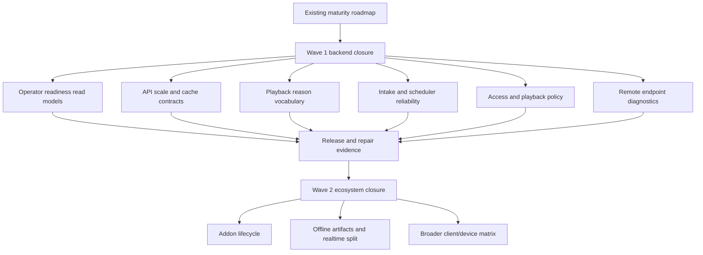
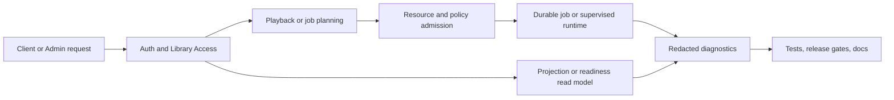

# feat: Execute Nako backend self-hosted maturity

## Summary

Turn the media-server maturity roadmap into a backend-first execution program for self-hosted product closure. The plan prioritizes operator-ready control-plane evidence, large-library API contracts, playback explainability, intake reliability, access policy, and remote endpoint diagnostics before broad Addon lifecycle work.

---

## Problem Frame

Nako already has a strong backend foundation: Media Library scanning, VFS/source identity, metadata governance, playback/transcode planning, durable jobs, Admin diagnostics, Public Client contracts, Addons, and release gates. The current gap is not a missing architecture baseline. The gap is product closure under self-hosted operating conditions: larger libraries, restarts, remote storage pressure, playback incompatibility, access boundaries, and safe remote exposure all need stable backend contracts and evidence.

The existing media-server maturity plan remains the strategic umbrella. This plan is a narrower execution overlay for backend work. It deliberately leaves frontend polish, broad client matrix work, and Addon lifecycle productization outside the first wave unless backend contracts prove they are blocking the self-hosted loop.

---

## Requirements

**Execution governance**

- R1. Each backend maturity slice must ship as a focused Trellis task with repo-relative context, acceptance criteria, verification evidence, and a conventional commit.
- R2. Refactors must remove replaced legacy paths once characterization tests prove the new path owns the behavior.
- R3. Public API, schema, storage, resource policy, or cross-crate contract changes must update the matching ADR, architecture map, or Trellis spec before closeout.

**Operator and control-plane readiness**

- R4. Operator-facing backend read models must expose setup, scan, playback, storage, network, backup, durable-job, and repair pressure without raw paths, Source Locators, credentials, tokens, provider payloads, or backend URLs.
- R5. Long-running backend work must use durable jobs or supervised runtime tasks with typed resource classes, retry/backoff evidence, cancellation or recovery semantics, and redaction-safe diagnostics.

**Large-library and API scale**

- R6. Browse, search, artwork, playback artifact, Admin list, and Public Client list routes must have bounded pagination, stable ordering, access filtering, and cache validator semantics before the UI can claim scalable browsing.
- R7. Query-shape tests must cover large-library edge cases, including sort ties, search projection access boundaries, missing total-count assumptions, and cache validators scoped by principal and Library Access.

**Playback maturity**

- R8. Playback Source Selection must produce a redaction-safe reason vocabulary for Direct Play, Remux, Transcode, and Denied outcomes.
- R9. Client capability facts must remain the shared input for playback planning, Admin diagnostics, Public Client responses, and future device profile work.

**Intake, storage, and repair**

- R10. Watcher, stable-candidate intake, scan admission, source fingerprint jobs, source duplicate suggestions, and VFS cache repair must behave as one observable intake and repair workflow.
- R11. VFS cache mutation and automation policies must stay non-destructive until an explicit mutation policy, operator guardrail, and rollback story are verified.

**Access, remote posture, and scope control**

- R12. User, Library Access, Playback Permission Policy, User Playback State, and playback tickets must deny unauthorized work before staging, VFS reads, or FFmpeg startup.
- R13. Remote access work must start with endpoint discovery, reverse-proxy/tunnel diagnostics, and redacted readiness facts, not a first-party relay or central account service.
- R14. Addon lifecycle remains wave-two backend work unless a wave-one contract directly blocks official Addon catalog or sidecar safety.

---

## Key Technical Decisions

- KTD1. Keep this as an execution overlay, not a replacement roadmap: the existing maturity roadmap and parity matrix still define product direction; this plan chooses backend order and quality gates.
- KTD2. Start with backend contracts that unblock product loops: large-library API contracts, playback reasons, intake reliability, access policy, and endpoint diagnostics are higher leverage than adding new feature categories.
- KTD3. Treat the control plane as the default home for durable or supervised work: scan, source hash, VFS repair, playback-adjacent jobs, Addon tasks, and remote diagnostics must not hide resource policy in route helpers.
- KTD4. Make read models first-class backend products: operator and client surfaces should consume redaction-safe projections rather than reconstructing status from raw persistence rows.
- KTD5. Make playback reasons a public contract: compatibility explanations must be stable enough for Admin Web, Media Web, Android, and future clients to share.
- KTD6. Keep VFS repair mutation policy conservative: selected refresh, read-only remediation, and manual durable repair remain the baseline until destructive or automatic mutations have explicit safeguards.
- KTD7. Defer broad Addon lifecycle to wave two: Addon discovery and official catalog work matter, but the first wave should harden the self-hosted server loop that Addons depend on.
- KTD8. Delete obsolete compatibility shims only after proof: cleanup targets include old source-key fallbacks, legacy resource-class mappings, and legacy principal normalization when no current migration, route, or test relies on them.

---

## High-Level Technical Design

---

## Scope Boundaries

### In Scope

- Backend execution planning and Trellis task breakdown for self-hosted maturity.
- Large-library browse/search/artwork/Admin/Public Client list contract hardening.
- Playback compatibility reason and capability-profile contract hardening.
- Watcher/intake/scheduler/VFS repair workflow hardening.
- User, Library Access, Playback Permission Policy, and ticket denial ordering.
- Remote endpoint discovery and readiness diagnostics.
- Removal of obsolete compatibility shims when tests prove replacement behavior.

### Deferred to Follow-Up Work

- Addon Manager process supervision, one-click install, or automatic updates.
- Offline downloads and durable optimized media artifacts.
- Realtime gateway implementation beyond contract design needed by current slices.
- Full TV client matrix and native-device profile database.
- Hardware tone-map execution breadth and remote transcode workers.
- Broad metadata undo/audit expansions unless a current backend slice requires them.

### Outside This Product's Identity

- Jellyfin Plugin Compatibility.
- Native in-process plugin ABI.
- Plex-style central account dependency.
- Default first-party traffic relay.
- Addon direct database, filesystem, or storage mutation.
- Copying GPL reference source, schemas, migrations, tests, assets, or generated code.

---

## Implementation Units

### U1. Operator Readiness And Control-Plane Audit

- **Goal:** Produce a backend readiness read model and cleanup audit that tells an operator whether the self-hosted server can scan, browse, play, diagnose, repair, expose remotely, and recover from backup.
- **Requirements:** R1, R2, R3, R4, R5.
- **Dependencies:** Existing M1 release ladder evidence and Admin diagnostics.
- **Files:** `crates/nako-api/src/admin.rs`, `crates/nako-api/src/admin/network.rs`, `crates/nako-server/src/app/startup.rs`, `crates/nako-server/src/app/runtime.rs`, `crates/nako-server/src/app/jobs.rs`, `crates/nako-server/src/http/admin.rs`, `crates/nako-server/src/http/network.rs`, `crates/nako-server/src/http/tests/admin_route_inventory.rs`, `crates/nako-server/src/app/tests/startup.rs`.
- **Patterns to follow:** `docs/architecture/CONTROL_PLANE.md`, `docs/architecture/OPERATIONS_RELEASE.md`, `docs/architecture/M1_ADMIN_DIAGNOSTICS_REPAIR_COVERAGE.md`, `.trellis/spec/nako-server/backend/index.md`.
- **Test scenarios:**
  - A clean SQLite install reports auth, Media Library, playback dependency, storage, network, backup, and durable-job readiness without raw host details.
  - A degraded storage or repair condition appears as a stable safe reason and links to existing repair/job facts.
  - A missing FFmpeg or network endpoint misconfiguration is reported without command lines, tokens, host paths, or backend URLs.
  - The cleanup audit records candidate obsolete shims and only marks a shim removable when tests and search prove no current caller depends on it.
- **Verification:** Focused `nako-server` app/HTTP tests plus `git diff --check`; broaden to release-gate fast mode only when readiness output changes release evidence.

### U2. Public Browse, Search, And Cache Contract Hardening

- **Goal:** Make Media Library browse and search routes match the frontend's sort/filter/search expectations through backend contracts instead of fixture-only behavior.
- **Requirements:** R1, R3, R6, R7, R12.
- **Dependencies:** U1 for readiness surfacing when list contracts affect operator status.
- **Files:** `crates/nako-client-protocol/src/catalog.rs`, `crates/nako-api/src`, `crates/nako-server/src/http/catalog.rs`, `crates/nako-server/src/http/library.rs`, `crates/nako-server/src/app/catalog.rs`, `crates/nako-server/src/app/library.rs`, `crates/nako-db/src/accessible_search.rs`, `crates/nako-db/src/search_tests.rs`, `crates/nako-db/src/contract_tests.rs`, `crates/nako-db/src/sqlite/search.rs`, `crates/nako-db/src/postgres/core_catalog.rs`.
- **Patterns to follow:** `docs/architecture/STATE_ACCESS.md`, `docs/architecture/CONTROL_PLANE.md`, `.trellis/spec/nako-api/backend/admin-and-public-contracts.md`, `.trellis/spec/nako-client-protocol/backend/index.md`, `.trellis/spec/nako-db/backend/index.md`.
- **Test scenarios:**
  - Public browse returns bounded pages with stable ordering for title, release date, recently added, and last played where those sort keys are supported.
  - Search and filter combinations never return items outside Library Access.
  - Cache validators and `304` behavior are scoped by principal and Library Access.
  - Clients can combine search text, filters, and pagination without assuming a total count.
- **Verification:** `cargo nextest run -p nako-db` focused browse/search contract tests, `cargo nextest run -p nako-server` focused catalog/library HTTP tests, and generated contract checks when DTOs change.

### U3. Playback Capability And Reason Contract

- **Goal:** Make Direct Play, Remux, Transcode, and Denied decisions explainable through a shared compatibility reason vocabulary.
- **Requirements:** R1, R3, R8, R9, R12.
- **Dependencies:** U2 for Public Client contract shape if playback source lists include reason facts.
- **Files:** `crates/nako-playback/src/capability.rs`, `crates/nako-playback/src/lib.rs`, `crates/nako-playback/src/values.rs`, `crates/nako-transcode/src/policy.rs`, `crates/nako-server/src/app/playback/selection.rs`, `crates/nako-server/src/app/playback/resource.rs`, `crates/nako-server/src/http/playback.rs`, `crates/nako-server/src/http/tests/playback.rs`, `crates/nako-api/src/admin/playback.rs`.
- **Patterns to follow:** `docs/architecture/PLAYBACK.md`, `docs/adr/0038-playback-planning-and-transcode-policy-seams.md`, `docs/adr/0044-playback-capability-profile-planner.md`, `.trellis/spec/nako-playback/backend/index.md`, `.trellis/spec/nako-transcode/backend/index.md`.
- **Test scenarios:**
  - A client missing a video codec receives a Transcode decision with the exact safe compatibility condition.
  - A client supporting video but not audio receives Remux or Transcode according to policy and explains the audio requirement.
  - A denied playback policy stops before staging or FFmpeg startup and emits a policy reason.
  - Known subtitle and HDR cases keep sidecar, burn-in, tone-map, or deny reasons stable across planner and HTTP responses.
- **Verification:** Focused playback planner tests, `nako-server` playback HTTP tests, and contract snapshots when public DTOs change.

### U4. Intake, Scheduler, And Storage Repair Workflow

- **Goal:** Treat watcher events, stable-candidate intake, scan admission, source fingerprint jobs, duplicate suggestions, and VFS cache repair as one resource-admitted workflow.
- **Requirements:** R1, R2, R5, R10, R11.
- **Dependencies:** Existing M2 watcher reliability and VFS cache repair durable policy slices.
- **Files:** `crates/nako-library/src/intake.rs`, `crates/nako-library/src/ingestion.rs`, `crates/nako-library/src/source_hash.rs`, `crates/nako-server/src/app/acquisition_intake.rs`, `crates/nako-server/src/app/watch_folder_runtime.rs`, `crates/nako-server/src/app/jobs.rs`, `crates/nako-server/src/app/source_hash.rs`, `crates/nako-server/src/app/storage.rs`, `crates/nako-server/src/app/vfs_cache_repair_runtime.rs`, `crates/nako-server/src/app/tests/startup.rs`, `crates/nako-server/src/app/tests/source_hash.rs`, `crates/nako-server/src/app/tests/storage.rs`.
- **Patterns to follow:** `docs/architecture/LIBRARY_PIPELINE.md`, `docs/architecture/STORAGE_VFS.md`, `docs/architecture/CONTROL_PLANE.md`, `.trellis/spec/nako-server/backend/source-fingerprint-hash-policy.md`, `.trellis/spec/nako-library/backend/quality-guidelines.md`.
- **Test scenarios:**
  - Stable watch-folder evidence enqueues exactly one library scan and reuses queued/running same-library work.
  - Scan-originated source fingerprint escalation creates safe durable jobs without raw locators.
  - VFS cache repair automation stays disabled or non-destructive unless an explicit operator action or policy gate enqueues work.
  - Legacy source-key and resource-class compatibility paths are removed only after equivalent current-key tests pass.
- **Verification:** Focused `nako-library`, `nako-server` startup/source-hash/storage tests and DB job contract tests when queue behavior changes.

### U5. Access And Playback Policy Enforcement

- **Goal:** Ensure User, Library Access, Playback Permission Policy, User Playback State, and playback tickets enforce policy before expensive backend work starts.
- **Requirements:** R3, R5, R6, R8, R12.
- **Dependencies:** U2 for access-filtered browse/search and U3 for denied playback reasons.
- **Files:** `crates/nako-core/src/identity.rs`, `crates/nako-core/src/playback_policy.rs`, `crates/nako-core/src/user_playback.rs`, `crates/nako-core/src/repository/playback_policy.rs`, `crates/nako-db/src/sqlite/access.rs`, `crates/nako-db/src/postgres/access.rs`, `crates/nako-server/src/app/access.rs`, `crates/nako-server/src/app/playback_ticket.rs`, `crates/nako-server/src/app/user_playback.rs`, `crates/nako-server/src/http/user_playback.rs`, `crates/nako-server/src/app/tests/user_playback.rs`, `crates/nako-server/src/http/tests/user_playback.rs`.
- **Patterns to follow:** `docs/architecture/STATE_ACCESS.md`, `docs/adr/0028-user-playback-state-principal-and-public-contract.md`, `.trellis/spec/nako-core/backend/index.md`, `.trellis/spec/nako-server/backend/http-api-patterns.md`.
- **Test scenarios:**
  - A principal without Library Access cannot browse, search, request playback, validate tickets, or write progress for that library.
  - A remote or transcode-denied principal receives a safe denial before VFS staging or FFmpeg startup.
  - Continue Watching and User Playback State stay principal-scoped after sort/filter changes.
  - Single-Admin Mode remains a compatibility mode and does not bypass explicit policy tests.
- **Verification:** Focused app/HTTP tests and repository parity tests for any new policy persistence.

### U6. Remote Endpoint Discovery And Diagnostics

- **Goal:** Make self-hosted LAN, reverse-proxy, and tunnel exposure diagnosable by backend contracts without introducing a relay.
- **Requirements:** R1, R3, R4, R5, R13.
- **Dependencies:** U1 for readiness aggregation.
- **Files:** `crates/nako-api/src/admin/network.rs`, `crates/nako-server/src/config.rs`, `crates/nako-server/src/config/preflight.rs`, `crates/nako-server/src/app/startup.rs`, `crates/nako-server/src/app/management_context.rs`, `crates/nako-server/src/http/network.rs`, `crates/nako-server/src/http/system.rs`, `crates/nako-server/src/http/tests/system.rs`, `docs/deployment/SELF_HOSTED.md`.
- **Patterns to follow:** `docs/architecture/CONTROL_PLANE.md#self-hosted-remote-access`, `docs/architecture/OPERATIONS_RELEASE.md#self-hosted-remote-access-cookbook`, `docs/deployment/SELF_HOSTED.md`.
- **Test scenarios:**
  - LAN, configured public base URL, reverse-proxy headers, and tunnel mode produce safe endpoint readiness facts.
  - Misconfigured remote access reports stable safe reasons without exposing tokens, internal IPs beyond configured safe display, or secret query strings.
  - Endpoint discovery does not alter auth, playback tickets, or Public Client route authorization.
  - Remote-access config gates and docs stay aligned with the backend readiness enum.
- **Verification:** Focused network/system HTTP tests, config-preflight tests, and remote-access config gate when docs or scripts change.

### U7. Wave-Two Addon Lifecycle Readiness

- **Goal:** Prepare the backend for Addon lifecycle productization after wave-one server contracts are hard enough.
- **Requirements:** R1, R3, R5, R14.
- **Dependencies:** U1, U2, U6.
- **Files:** `crates/nako-addon-protocol/src/lib.rs`, `crates/nako-addon-client/src/lib.rs`, `crates/nako-official-addon-catalog/src/lib.rs`, `crates/nako-server/src/app/addons/catalog.rs`, `crates/nako-server/src/app/addons/runtime.rs`, `crates/nako-server/src/http/addons.rs`, `docs/plans/ADDON_ECOSYSTEM_STRATEGY.md`, `docs/guides/ADDON_AUTHOR_GUIDE.md`.
- **Patterns to follow:** `docs/adr/0020-jellyfin-like-sidecar-addons-with-scoped-api-access.md`, `.trellis/spec/nako-server/backend/addon-resource-flow-patterns.md`, `.trellis/spec/nako-official-addon-catalog/backend/index.md`.
- **Test scenarios:**
  - Official Addon descriptors distinguish Addon Version, Addon Protocol Version, compatible Nako version, health path, scopes, and trust tier.
  - Token rotation and grants remain redaction-safe and never expose admin credentials.
  - Hosted pages and install guides do not imply Nako-owned process supervision.
  - Addon side effects remain host-owned through selection, plan, materialization, and apply boundaries.
- **Verification:** Official catalog validation, Addon client/protocol tests, and server grant/redaction tests when lifecycle facts become routes.

### U8. Documentation, Spec, And Deletion Closeout

- **Goal:** Keep durable architecture documents, Trellis specs, and cleanup evidence aligned with shipped backend maturity slices.
- **Requirements:** R1, R2, R3, R14.
- **Dependencies:** Runs after each code-bearing unit.
- **Files:** `docs/ROADMAP.md`, `docs/ARCHITECTURE.md`, `docs/architecture/CONTROL_PLANE.md`, `docs/architecture/PLAYBACK.md`, `docs/architecture/LIBRARY_PIPELINE.md`, `docs/architecture/STORAGE_VFS.md`, `docs/architecture/STATE_ACCESS.md`, `docs/architecture/OPERATIONS_RELEASE.md`, `.trellis/spec/nako-server/backend/index.md`, `.trellis/spec/nako-api/backend/index.md`, `.trellis/spec/nako-db/backend/index.md`.
- **Patterns to follow:** `docs/development/REFACTORING_POLICY.md`, `docs/architecture/LANES.md`, `.trellis/spec/guides/code-reuse-thinking-guide.md`, `.trellis/spec/guides/cross-layer-thinking-guide.md`.
- **Test scenarios:** No standalone runtime tests. Each code-bearing unit must prove its own behavior before docs claim maturity.
- **Verification:** `git diff --check`, task validation, targeted docs review, and spec updates when public or cross-crate behavior changes.

---

## First Batch Execution Queue

| Order | Task seed | Primary unit | Why first |
| --- | --- | --- | --- |
| 1 | `backend-readiness-control-plane-audit` | U1 | Establishes the operator evidence surface and identifies deletion candidates before deeper refactors. |
| 2 | `public-library-browse-scale-contract` | U2 | Frontend browse/filter/search now needs backend-supported semantics rather than fixture-only behavior. |
| 3 | `playback-reason-public-contract` | U3 | Playback support must be explainable before adding more device/client breadth. |
| 4 | `intake-scheduler-repair-workflow-audit` | U4 | M2 reliability depends on intake, source hash, duplicate, and VFS repair behaving as one observable workflow. |
| 5 | `remote-endpoint-readiness-diagnostics` | U6 | Self-hosted deployment trust needs backend-verifiable endpoint posture before broader remote UX. |

U5 can start once U2 and U3 expose the access and reason seams it needs. U7 waits until the first batch proves control-plane, API, and remote readiness contracts are stable.

---

## Risks And Dependencies

| Risk | Impact | Mitigation |
| --- | --- | --- |
| The plan turns into one broad refactor wave | High | Keep each Trellis child task independently shippable and delete only within the touched behavior. |
| Backend contracts trail frontend expectations | High | Start with Public Client browse/search scale and explicit contract tests. |
| Redaction regressions leak host details | High | Require negative tests for paths, Source Locators, fingerprints, tokens, provider payloads, and backend URLs. |
| Playback reason vocabulary hardens incorrectly | Medium | Start from current planner facts and preserve unknown/unsupported states instead of pretending completeness. |
| Storage repair automation becomes destructive too early | High | Keep wave-one repair non-destructive and policy-gated. |
| Addon lifecycle pulls in process supervision | Medium | Keep Addon lifecycle wave two and sidecar-first unless a backend contract is blocking. |

---

## Acceptance Examples

- AE1. Given a clean self-hosted install, when the admin reads backend readiness, then Nako reports auth, library, playback, storage, network, backup, durable-job, and repair posture with no raw host details.
- AE2. Given a Media Library with many items, when a client combines sort, filter, search, and pagination, then the backend returns a bounded access-filtered page with stable ordering.
- AE3. Given a client that cannot Direct Play a Media Source, when it requests playback, then Nako returns a safe reason that explains the chosen Remux, Transcode, or Denied outcome.
- AE4. Given a watched file that is still changing, when the runtime observes it, then Nako keeps it in stable-candidate intake and does not enqueue duplicate scans.
- AE5. Given a user without access to a Media Library, when they use an old playback ticket, then Nako denies before VFS staging or FFmpeg startup.
- AE6. Given a reverse-proxy configuration with missing public base URL, when Admin diagnostics run, then Nako reports a safe endpoint readiness reason without exposing secret headers or tokens.

---

## Documentation / Operational Notes

Each child task should record whether it updates architecture docs, Trellis specs, API contracts, or deployment runbooks. Backend maturity is not complete when code passes focused tests; it is complete when the self-hosted operator path has evidence and the docs no longer overclaim unsupported behavior.

When a slice removes legacy code, the PR or task closeout must identify the replacement behavior and the test or search evidence that proves the old path is unused.

---

## Sources / Research

- `docs/plans/2026-06-10-001-feat-media-server-maturity-roadmap-plan.md`
- `docs/plans/MEDIA_SERVER_PARITY_GAP_MATRIX.md`
- `docs/plans/PRODUCT_STRATEGY_IMPLEMENTATION_BACKLOG.md`
- `docs/ROADMAP.md`
- `docs/ARCHITECTURE.md`
- `docs/architecture/CONTROL_PLANE.md`
- `docs/architecture/PLAYBACK.md`
- `docs/architecture/LIBRARY_PIPELINE.md`
- `docs/architecture/STORAGE_VFS.md`
- `docs/architecture/STATE_ACCESS.md`
- `docs/architecture/OPERATIONS_RELEASE.md`
- `docs/architecture/M1_ADMIN_DIAGNOSTICS_REPAIR_COVERAGE.md`
- `docs/deployment/SELF_HOSTED.md`
- `docs/deployment/BACKUP_RESTORE_UPGRADE.md`
- `docs/development/REFACTORING_POLICY.md`
- `.trellis/tasks/archive/2026-06/06-10-media-server-gap-analysis/`
- `.trellis/tasks/archive/2026-06/06-13-research-nako-product-competitive-analysis/`
- `.trellis/tasks/archive/2026-06/06-14-06-14-m2-large-library-reliability-plan/`
- `.trellis/tasks/archive/2026-06/06-14-nako-server-control-plane-seam-deepening/`
- `.trellis/spec/guides/code-reuse-thinking-guide.md`
- `.trellis/spec/guides/cross-layer-thinking-guide.md`
