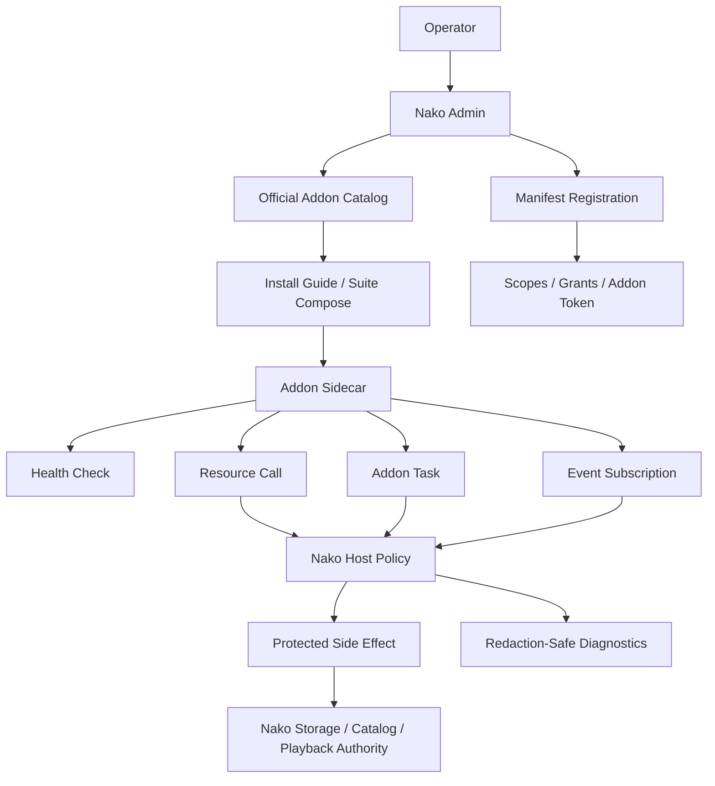

# Nako Addon Ecosystem Strategy

## Summary

Nako's Addon strategy should make extensibility feel Jellyfin-like without
adopting Jellyfin Plugin Compatibility or an in-process native plugin ABI.

The product direction is:

- Addons run as out-of-process Addon Sidecars.
- Manifests declare resources, tasks, event subscriptions, entry points,
  hosted pages, configuration schema, secret reference fields, and scopes.
- Nako owns registration, grants, Addon Tokens, health checks, task lifecycle,
  protected side effects, storage writes, catalog mutation, and diagnostics.
- Official Addons should be packaged as a low-friction suite where lifecycle
  and trust match, while permission and audit remain per Addon.

## Current State

Official Addons currently include:

- `nako-metadata-scraper`: metadata resource, bulk metadata scrape task,
  `library.scanned` event proof, metadata/artwork writeback through Nako
  runtime gates.
- `nako-notification-bridge`: ACK-only event proof plus explicit single
  provider fan-out for HTTP webhook, Discord, or Telegram.
- `nako-chromecast-renderer`: Chromecast renderer adapter with manual/live
  discovery and control gates.
- `nako-dlna-renderer`: plan-only DLNA renderer adapter foundation.
- `nako-resource-search`: `resource_search` and `resource_link_check` with
  fixture and optional PanSou-compatible provider.
- `nako-external-acquisition-runner`: fixture/no-op external acquisition action
  task with host-owned opaque references and optional materialization path.
- `nako-subtitle-provider`: read-only fixture subtitle candidate resource.
- `browser-worker`: browser-render helper used by metadata providers; not an
  Addon manifest unit.

Current strengths:

- Protocol concepts are already concrete, not only theoretical.
- Addon side effects go through Nako runtime APIs and grants.
- Resource Search and External Acquisition are deliberately separated.
- Manifest facts are generated through `nako-official-addon-catalog`, reducing
  drift.
- Diagnostics and Debug output emphasize redaction.

Current gaps:

- No stable user-facing Addon catalog or marketplace.
- No unified official Addon Suite packaging.
- Container smoke does not cover every official Addon.
- Third-party authoring kit is not mature.
- Addon Manager lifecycle is intentionally not implemented yet.
- Protocol remains alpha and should not overpromise third-party stability.

## Ecosystem Architecture

## Strategy

### 1. Catalog Before Manager

Build a stable official catalog before implementing host-managed lifecycle.
The catalog should be machine-readable and generated from the same source as
official manifest/install descriptors.

Catalog facts:

- addon id;
- addon version;
- Addon Protocol Version;
- compatible Nako version range;
- resource/task/event declarations;
- required scopes;
- default port;
- binary/container references;
- compose snippet reference;
- health path;
- docs URL;
- trust tier;
- release/smoke status.

Why:

- Users need discovery and compatibility before one-click install.
- It avoids making Nako responsible for Docker/systemd/Kubernetes too early.
- It gives release gates a stable inventory.

### 2. Suite Packaging Without Permission Collapse

Official Addons that share lifecycle and trust can ship as an Addon Suite, but
Nako must preserve per-Addon manifests, grants, tasks, events, side effects,
and diagnostics.

First suite candidate:

- metadata scraper;
- browser worker;
- resource search;
- subtitle provider;
- notification bridge;
- external acquisition runner as disabled or optional;
- renderer adapters as optional sidecars.

Suite goals:

- one Compose example for the common alpha media extension setup;
- clear environment variables and Secret Reference placeholders;
- direct and Nako-mediated smoke commands;
- no Docker socket, systemd control, or hidden process lifecycle authority.

### 3. Author Kit After Official Conformance

Third-party Addon authoring should start after official Addons have stable
conformance gates.

Author kit contents:

- Rust, TypeScript, and Python minimal sidecar templates;
- manifest validation CLI or test helper;
- health/resource/task/event envelope test fixtures;
- redaction tests for Debug/log/diagnostic output;
- Dockerfile and Compose templates;
- examples for read-only resource, protected side effect, and task execution.

### 4. Trust Tiers

Addon surfaces should declare risk and default posture:

| Tier | Examples | Default | Required policy |
| --- | --- | --- | --- |
| Local fixture | fixture metadata, fixture subtitles | Enabled for smoke | No external network |
| Official read-only | metadata search, subtitle discovery, resource search | Disabled unless configured | Provider secrets/proxy redaction |
| Official side-effect | metadata/artwork writeback, acquisition runner | Disabled | Addon Token, library grants, idempotency |
| Renderer adapter | Chromecast/DLNA | Plan-only by default | Ticket/url redaction and manual/live gates |
| Notification fan-out | webhook, Discord, Telegram | ACK-only by default | One provider or explicit fan-out policy |
| Rendered/high-risk provider | browser-worker, AV providers, scraping | Disabled | Terms risk, proxy/cookie redaction, drift checks |
| Community addon | third-party sidecar | Disabled | Conformance and source trust disclosure |

### 5. High-Value Addon Categories

Priority categories:

- OpenSubtitles/live subtitle provider.
- Trakt/scrobble and watched-state sync.
- LDAP/OIDC auth bridge or integration.
- Playback reporting/reports.
- Live TV/tuner integration, likely through Tunarr/ErsatzTV/Dispatcharr first.
- Kometa-like metadata/artwork/collection curation.
- Servarr/Seerr acquisition and request workflow integration.

Defer:

- embedded trusted frontend plugins;
- native plugin ABI;
- automatic third-party package updates;
- built-in downloader or torrent client without host-owned policy;
- broad marketplace before protocol stability.

## Alternatives Considered

### Option A: In-Process Native Plugins

How it works:

- Load plugin code into the Nako server process.
- Let plugins call internal server objects directly.

Pros:

- Lower runtime overhead.
- Easier to expose deep extension hooks.
- Familiar to Jellyfin plugin authors.

Cons:

- Weak crash isolation.
- Hard permission boundaries.
- Strong ABI/version coupling.
- Violates current Nako architecture and reference-code discipline.

Decision: rejected.

### Option B: Host-Managed Addon Manager First

How it works:

- Nako installs, starts, stops, updates, and removes Addon processes or
  containers in the first ecosystem slice.

Pros:

- Better first-run UX.
- Feels closer to a plugin marketplace.

Cons:

- Requires Docker/systemd/Kubernetes policy too early.
- Increases host privilege and attack surface.
- Blurs protocol, package, lifecycle, and trust boundaries.

Decision: rejected for the near term.

### Option C: Catalog + Suite + Sidecar Conformance

How it works:

- Ship a generated official catalog, suite packaging, and conformance harness
  while keeping lifecycle operator-owned.

Pros:

- Improves usability without weakening trust boundaries.
- Gives third-party authors a stable target.
- Aligns with existing Addon Protocol and official Addon repository.

Cons:

- Still less convenient than a one-click plugin manager.
- Requires careful docs and release-gate maintenance.

Decision: recommended.

## Success Metrics

| Metric | Current | Target | Measurement |
| --- | --- | --- | --- |
| Official Addon inventory | Spread across docs/manifests | Generated catalog covers all official Addons | Catalog validation |
| Smoke coverage | Partial container smoke | All official Addons plus browser-worker covered by local/container smoke | Release gate |
| Suite usability | Individual examples | One official suite Compose path for common setup | Operator smoke |
| Third-party readiness | Rust protocol/client crates | Rust/TypeScript/Python starter templates and conformance tests | Author kit review |
| Redaction posture | Strong local tests in parts | Conformance gate checks diagnostics/log-safe behavior | Test harness |
| Protocol promise clarity | Alpha notes | Docs distinguish Addon Version, Protocol Version, and Nako version | Docs review |

## Risks And Mitigations

| Risk | Severity | Likelihood | Mitigation |
| --- | --- | --- | --- |
| Users expect one-click install | Medium | High | Explain catalog vs manager; provide suite Compose and install guides |
| Addon Suite collapses permissions | High | Medium | Keep per-Addon manifests, grants, tokens, tasks, events, diagnostics |
| High-risk providers create legal or reliability issues | High | Medium | Trust tiers, default disabled posture, provider policy docs, drift checks |
| Cross-repo protocol drift | High | Medium | Generate catalog/manifests, add cross-repo smoke and conformance tests |
| Third-party authors overfit alpha protocol | Medium | Medium | Label compatibility clearly and avoid stable marketplace claims |
| Notification/acquisition retries duplicate side effects | High | Medium | Require idempotency keys, task identity, and explicit fan-out policy |

## Work Plan

### Phase 1: Catalog And Inventory

- Generate a durable official Addon catalog document or artifact.
- Include compatibility, scopes, install references, health path, trust tier,
  and smoke status.
- Link catalog from Nako docs and official Addons README.

### Phase 2: Full Official Smoke

- Extend container smoke to metadata, notification, Chromecast, DLNA, resource
  search, external acquisition runner, subtitle provider, and browser-worker
  integration.
- Keep Nako-mediated smoke separate from sidecar-only smoke.

### Phase 3: Official Suite Packaging

- Provide an official Compose suite for common Addon setup.
- Keep secrets as placeholders and Secret References.
- Document enablement order: register, health check, token/grant, enable,
  resource/task call.

### Phase 4: Author Kit

- Build minimal sidecar templates.
- Publish conformance tests and redaction helpers.
- Add examples for resource, task, event, hosted diagnostics, and protected
  side effect.

## Source Documents

- [Official Addons current state](../research/nako-product-competitive-analysis/official-addons-current-state.md)
- [Competitive analysis first pass](../research/nako-product-competitive-analysis/competitive-analysis-first-pass.md)
- [Addon author guide](../guides/ADDON_AUTHOR_GUIDE.md)
- [ADR 0020: Jellyfin-like sidecar Addons](../adr/0020-jellyfin-like-sidecar-addons-with-scoped-api-access.md)
- [ADR 0034: Addon suites](../adr/0034-package-addon-capabilities-into-sidecar-suites.md)
