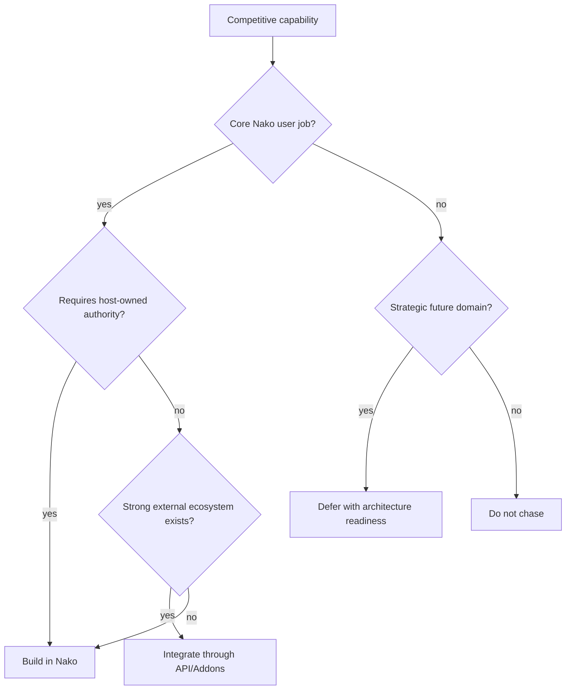

# Nako Media Server Parity Gap Matrix

## Summary

This matrix turns competitive research into product choices. It is not a
commitment to clone Jellyfin, Plex, or Emby. It classifies expected media-server
capabilities into four actions:

- **Build**: Nako should implement this as a core product capability.
- **Integrate**: Nako should expose stable APIs or Addons for existing ecosystem
  tools.
- **Defer**: Nako should keep the architecture ready but avoid near-term scope.
- **Do not chase**: Nako should explicitly avoid this product direction.

## Decision Flow

## Core Parity Matrix

| Capability | Jellyfin/Plex/Emby Expectation | Nako Current Signal | Action | Rationale |
| --- | --- | --- | --- | --- |
| Install and first setup | Clear server setup and admin workflow | Alpha docs, config check, Docker/Compose, release gates | Build | Required for Product-Operator readiness |
| Media Library scan | Scan local libraries and maintain item state | Strong backend foundation: scan, source state, local inference | Build | Core server job |
| Incremental watcher | Detect new or changed files safely | Stable-candidate foundation; productization weak | Build | Needed for real library usability |
| Metadata providers | TMDB/anime/local providers and user overrides | TMDB, Bangumi, Douban, official metadata addon breadth | Build + Integrate | Built-in baseline plus Addon providers |
| NFO and sidecars | Import/export local metadata and artwork | Strong local authority vocabulary and NFO support | Build | Nako differentiation |
| Artwork candidates and derivatives | Posters, backdrops, thumbnails, caching | Managed artwork foundation | Build | Required for perceived UX |
| Browse/search | Fast library browse and filtering | Catalog/search projection foundations | Build | Client-critical |
| Direct Play | Serve compatible media without transcode | Shipped baseline | Build | Core playback path |
| Remux/Direct Stream | Container/stream-compatible transformation | Shipped foundation | Build | Expected by media-server users |
| HLS transcode | Adaptive or compatible playback fallback | Strong first slices; many follow-ons remain | Build | Baseline parity and Nako planner strength |
| Hardware acceleration | GPU policy and diagnostics | Hardware report and planner foundation | Build | Mature user expectation |
| HDR/audio/subtitle compatibility | Tone mapping, downmix, subtitle sidecar/burn-in | First slices shipped; profiles and polish remain | Build | Needed for playback reliability |
| Client capability profiles | Device-aware playback decisions | Architecture direction exists | Build | Enables explainable playback |
| Web media client | Browse and playback in browser | First slice/foundation | Build | Required first visible client |
| Android client | Mobile browse/playback | Foundation exists | Build | Important but not first proof alone |
| TV clients | Android TV, Apple TV, Roku, webOS, Tizen | Mostly absent | Defer | Critical long-term, too expensive for early phase |
| Casting | Chromecast/DLNA/AirPlay-like output | Official Chromecast/DLNA sidecars | Build + Integrate | Renderer adapters fit Addon strategy |
| Remote access | Reverse proxy/VPN/tunnel support, Plex-style remote | Policy/readiness only; no relay | Build docs + Defer relay | Cookbook yes, first-party relay no |
| Multi-user/library access | Users, roles, household/library access | Foundation; Single-Admin Mode still early | Build | Avoid permanent single-user identity |
| Parental controls | Ratings, restrictions, profiles | Not a current product slice | Defer | Needs user/access foundation first |
| Watch state/progress | Per-user progress and watched status | User Playback State foundation | Build | Core retention and migration signal |
| Playlists/collections | User and curated grouping | Partial foundations | Build | Expected browse workflow |
| Downloads/offline | Mobile downloads and optimized versions | Not first-class yet | Defer | High value, separate artifact lifecycle |
| Live TV/DVR | Tuners, EPG, recording, guide | Not started as core | Integrate first, defer core | Ecosystem tools can bridge early |
| Plugin/Addons catalog | Discover/install/manage extensions | Protocol and official addons; weak entry | Build | Nako differentiation depends on this |
| In-process plugin ABI | Native host plugin code | Explicitly rejected | Do not chase | Violates Addon Sidecar boundary |
| Plex-style central account | Cloud account/device brokerage | Explicitly not Nako identity | Do not chase | Conflicts with self-hosted posture |
| First-party traffic relay | Central remote-access service | Deferred by architecture | Do not chase now | Cost, abuse, security, operations risk |
| Servarr integration | Request/acquisition ecosystem | Resource Search and acquisition seams | Integrate | Better to integrate before absorbing |
| Subtitle automation | Bazarr/OpenSubtitles-like workflows | Subtitle provider foundation | Build + Integrate | Addon provider plus import/write policy |
| Request management | Overseerr/Jellyseerr/Seerr workflows | Not core yet | Integrate | Strong external category |
| Metadata curation | Kometa-like overlays/collections | Metadata/artwork pipeline foundation | Integrate first | Addon/task fit |
| Transcode optimization | Tdarr/FileFlows/Unmanic workflows | Playback transcode strong; durable optimized versions deferred | Integrate + Defer | Distinguish playback transcode from optimized versions |
| Analytics/reporting | Tautulli/Jellystat expectations | Admin diagnostics strong, usage analytics absent | Build minimal + Integrate | Diagnostics first, analytics later |
| Cleanup/retention | Maintainerr-like library lifecycle | Storage diagnostics foundation | Defer + Integrate | Needs explicit policy safeguards |
| Cross-server state sync | WatchState/JellyPlex-Watched | Migration research only | Integrate | Important for adoption |
| Photo domain | Immich-class expectations | Long-term scope only | Defer | Needs domain-specific depth |
| Music domain | Navidrome-class expectations | Long-term scope only | Defer | Avoid thin generic support |
| Audiobooks/books | Audiobookshelf/Kavita/Komga expectations | Long-term scope only | Defer | Needs domain-specific UX |
| Online archive/import | Tube Archivist/yt-dlp workflows | Resource/acquisition seams | Integrate with policy | Legal and provider risk |

## Priority Buckets

### Must Build Before Beta

- First-operator setup, scan, browse, playback, diagnose path.
- Web media client and basic mobile playback readiness.
- Incremental intake productization.
- Device capability profiles and playback compatibility reasons.
- Addon catalog baseline and official Addon Suite packaging.
- Remote access cookbook with diagnostics, not a relay.
- NFO/artwork/provider ID portability documentation.

### Integrate Before Building Broadly

- Servarr and Seerr request/acquisition workflows.
- Bazarr/OpenSubtitles subtitle workflows.
- WatchState watched-state sync.
- Tunarr/ErsatzTV/Dispatcharr linear-TV workflows.
- Tdarr/FileFlows optimized media workflows.
- Tautulli/Jellystat-style usage reporting.
- Kometa-style collection/artwork curation.

### Defer Explicitly

- Full TV-client matrix.
- First-party relay or central account service.
- Native plugin ABI.
- Full Live TV/DVR core.
- Offline downloads and durable optimized versions until artifact policy is
  specified.
- Photo/music/book domain parity until video-first product is credible.

## Alternatives Considered

### Option A: Feature Parity Checklist

How it works:

- Enumerate every Jellyfin/Plex/Emby capability and attempt direct parity.

Pros:

- Simple to track.
- Easy for users to compare.

Cons:

- Overwhelms early roadmap.
- Treats ecosystem tools as missing core features.
- Encourages cloning instead of product strategy.

Decision: rejected.

### Option B: Nako-Only Architecture Roadmap

How it works:

- Ignore competitor feature expectations and build from Nako's internal
  architecture map.

Pros:

- Preserves architectural purity.
- Avoids overreacting to competitors.

Cons:

- Misses visible user expectations.
- Risks producing a technically strong backend with weak adoption.

Decision: rejected.

### Option C: Build / Integrate / Defer / Do Not Chase Matrix

How it works:

- Classify each capability by user job, host authority, ecosystem fit, and
  strategic risk.

Pros:

- Converts research into decisions.
- Protects scope while preserving market awareness.
- Fits Nako's Addon and control-plane strategy.

Cons:

- Requires continuous updates as product maturity changes.

Decision: recommended.

## Success Metrics

| Metric | Current | Target | Measurement |
| --- | --- | --- | --- |
| Parity decisions documented | Research only | All major expected capabilities classified | Matrix review |
| Beta scope clarity | Partial | Must-build bucket maps to roadmap tasks | ROADMAP/GOALS references |
| Integration posture | Ad hoc | Top ecosystem tools have integrate/defer decisions | Plan review |
| Deferred scope clarity | Partial | TV, relay, Live TV, native plugins, non-video domains have explicit status | Docs review |
| User-facing gap honesty | Partial | README/docs avoid overclaiming replacement readiness | Release docs review |

## Risks And Mitigations

| Risk | Severity | Likelihood | Mitigation |
| --- | --- | --- | --- |
| Matrix becomes stale | Medium | High | Review before milestone planning |
| Users see deferred items as abandonment | Medium | Medium | Use "defer" only with rationale and future trigger |
| Integrations become leaky half-features | High | Medium | Require host-owned API boundaries and conformance tests |
| Must-build list still too large | High | Medium | Tie must-build items to Product-Operator journey first |
| Competitor changes alter expectations | Medium | Medium | Refresh external research quarterly or before beta |

## Source Documents

- [Competitive analysis first pass](../research/nako-product-competitive-analysis/competitive-analysis-first-pass.md)
- [External competitive ecosystem supplement](../research/nako-product-competitive-analysis/external-competitive-ecosystem-supplement.md)
- [Nako current state](../research/nako-product-competitive-analysis/nako-current-state.md)
- [Roadmap](../ROADMAP.md)
