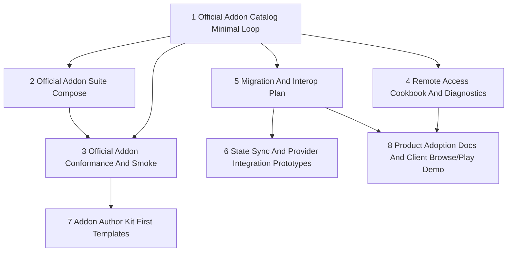

# Nako Product Strategy Implementation Backlog

## Summary

This backlog turns the product positioning and competitive research into
implementation-ready vertical slices.

It is intentionally narrower than the full media-server maturity plan. The
existing maturity plan covers broad engineering closure across operator
readiness, playback, intake, API scale, access policy, realtime/offline
foundations, and Addon lifecycle. This backlog focuses on the product-strategy
work that makes Nako easier to understand, adopt, extend, and migrate to.

Recommended first slice: **Official Addon Catalog Minimal Loop**.

Why this comes first:

- it converts Nako's Sidecar Addon architecture into a visible product surface;
- it creates a stable inventory for release gates and official Addon smoke;
- it improves adoption without requiring Nako to own Docker, systemd,
  Kubernetes, or one-click process lifecycle yet;
- it supports the positioning that Nako is extensible without being an
  in-process plugin host.

## Scope Boundaries

### This Backlog Covers

- Official Addon catalog and suite packaging.
- Official Addon conformance and smoke coverage.
- Remote access cookbook and diagnostics posture.
- Migration and interoperability planning.
- High-value ecosystem integration research and prototypes.
- Client browse/play polish needed to demonstrate the product positioning.
- Product documentation alignment.

### Covered Elsewhere

- Broad M1-M5 engineering maturity:
  `2026-06-10-001-feat-media-server-maturity-roadmap-plan.md`.
- Current roadmap ladder: `../ROADMAP.md`.
- Detailed Addon strategy: `ADDON_ECOSYSTEM_STRATEGY.md`.
- Competitive capability classification:
  `MEDIA_SERVER_PARITY_GAP_MATRIX.md`.

### Explicit Non-Goals

- Jellyfin Plugin Compatibility.
- Native in-process plugin ABI.
- Plex-style central account dependency.
- First-party remote traffic relay in the early phase.
- Addon process installation, update, or orchestration by the Nako server.
- Copying Jellyfin or other reference source code, schemas, migrations,
  comments, tests, assets, or generated files.

## Slice Map



## Vertical Slices

### 1. Official Addon Catalog Minimal Loop

Type: AFK.

Dependencies: none.

Goal:

- Expose a durable, generated inventory of official Addons that operators and
  release gates can trust.

Deliverables:

- A generated or validated official catalog artifact in the Nako repository.
- Catalog facts for each official Addon:
  - addon id;
  - addon version;
  - Addon Protocol Version;
  - compatible Nako version range;
  - resource, task, event, hosted-surface, and entry-point declarations;
  - required scopes and grants;
  - default port and health path;
  - install guide or compose snippet reference;
  - trust tier;
  - smoke status.
- Documentation that explains catalog versus manager:
  - catalog means discovery, compatibility, and install guidance;
  - manager means host-managed process lifecycle, which remains deferred.

Acceptance criteria:

- [ ] Every official Addon has one catalog row or descriptor.
- [ ] Catalog output can be checked in CI or by a local validation command.
- [ ] The catalog distinguishes Addon Version, Addon Protocol Version, and
      compatible Nako version.
- [ ] Required scopes and trust tier are visible without exposing secrets.
- [ ] Docs link the catalog from the Addon author/operator path.

Non-goals:

- One-click install.
- Nako-owned Docker/systemd/Kubernetes lifecycle management.
- Third-party marketplace.

### 2. Official Addon Suite Compose

Type: AFK.

Dependencies: slice 1.

Goal:

- Provide one low-friction Compose path for the common official Addon setup
  while preserving per-Addon permissions and diagnostics.

Deliverables:

- An official suite example that includes:
  - metadata scraper;
  - browser worker;
  - resource search;
  - subtitle provider;
  - notification bridge;
  - optional external acquisition runner;
  - optional Chromecast and DLNA renderer adapters.
- A registration and enablement sequence:
  - start sidecars;
  - register manifest;
  - health check;
  - grant scopes;
  - configure Secret References;
  - execute smoke resource/task calls.

Acceptance criteria:

- [ ] The suite can be followed without giving Nako access to the Docker socket.
- [ ] Each Addon keeps its own manifest, scopes, grants, token, health status,
      and diagnostics.
- [ ] Secrets are represented as placeholders or Secret References.
- [ ] Optional and disabled-by-default Addons are clearly marked.

Non-goals:

- Collapsing multiple Addons into one permission domain.
- Automatic updates.
- Hidden privileged host control.

### 3. Official Addon Conformance And Smoke

Type: AFK.

Dependencies: slices 1 and 2.

Goal:

- Make the official Addon set a conformance baseline for future third-party
  authors.

Deliverables:

- Sidecar-only smoke coverage for every official Addon and browser-worker.
- Nako-mediated smoke coverage where the host boundary matters:
  - token/grant enforcement;
  - resource calls;
  - task execution;
  - event delivery;
  - protected side effects;
  - redaction.
- A release-gate report that links catalog entries to smoke status.

Acceptance criteria:

- [ ] All official Addons have health and manifest validation coverage.
- [ ] Side-effect Addons prove host-owned writes and idempotency boundaries.
- [ ] Renderer Addons prove plan/control behavior without leaking tickets or
      playback URLs.
- [ ] Notification and acquisition Addons prove explicit fan-out or
      idempotency policy.
- [ ] Debug output does not expose tokens, provider secrets, proxy URLs, local
      paths, cookies, or raw provider payloads.

Non-goals:

- Full third-party SDK.
- Marketplace approval process.

### 4. Remote Access Cookbook And Diagnostics

Type: AFK.

Dependencies: none.

Goal:

- Give operators a supported remote-access posture without creating a
  Plex-style relay or central account service.

Deliverables:

- Deployment cookbook for:
  - reverse proxy;
  - VPN;
  - tunnel;
  - LAN-only mode.
- Diagnostics vocabulary for:
  - base URL;
  - forwarded headers;
  - HTTPS/TLS;
  - token configuration;
  - public reachability;
  - playback URL safety.
- Explicit warnings for unsupported relay and account-broker expectations.

Acceptance criteria:

- [ ] Docs explain when to use reverse proxy, VPN, or tunnel.
- [ ] Admin/readiness diagnostics can map network posture to safe
      operator-facing statuses.
- [ ] Playback and Addon URLs are discussed in terms of redaction and ticket
      lifetime.
- [ ] The docs avoid implying that Nako provides a hosted relay.

Non-goals:

- First-party relay.
- Central device broker.
- Dynamic DNS provider integration.

### 5. Migration And Interop Plan

Type: HITL.

Dependencies: none.

Goal:

- Define the migration story that makes Nako credible for Jellyfin, Plex,
  Emby, and NFO-heavy users.

Deliverables:

- A plan for importing, preserving, or mapping:
  - NFO metadata;
  - local artwork;
  - provider identifiers;
  - watched state and playback progress;
  - collections and playlists;
  - source paths and library roots;
  - user-visible ratings and tags where safe.
- A risk register for source systems:
  - available export formats;
  - licensing and API limits;
  - account or token requirements;
  - privacy and redaction risks.

Acceptance criteria:

- [ ] The plan separates local-authority data from provider-derived data.
- [ ] The plan states what can be imported without calling external services.
- [ ] Watched-state migration has a proposed direction before implementation.
- [ ] The plan identifies fields Nako should not ingest blindly.
- [ ] The plan names the first prototype source and why.

Non-goals:

- Full migration implementation.
- Scraping private cloud account data.
- Importing incompatible plugin-specific internals.

### 6. State Sync And Provider Integration Prototypes

Type: HITL.

Dependencies: slice 5.

Goal:

- Prototype the highest-value ecosystem integrations before absorbing those
  workflows into core Nako.

Deliverables:

- Prototype decision notes for one or more candidate integrations:
  - OpenSubtitles or another subtitle provider.
  - Trakt/scrobble and watched-state sync.
  - WatchState-style cross-server state sync.
  - Servarr/Seerr request and acquisition flow.
  - Kometa-style collection/artwork curation.

Acceptance criteria:

- [ ] Each prototype states whether it should become core, Addon, or external
      integration.
- [ ] Host-owned side effects remain behind Nako APIs and grants.
- [ ] Provider secrets and tokens are represented as Secret References.
- [ ] Terms, quota, and account requirements are documented before runtime
      implementation.

Non-goals:

- Building a downloader.
- Owning torrent or indexer workflows inside core Nako.
- Broad marketplace before protocol stability.

### 7. Addon Author Kit First Templates

Type: AFK.

Dependencies: slice 3.

Goal:

- Turn the official Addon conformance baseline into practical starting points
  for third-party Addon authors.

Deliverables:

- Minimal templates for:
  - read-only resource Addon;
  - task Addon;
  - event subscription Addon;
  - protected side-effect Addon.
- Starter implementations in the highest-value languages after official
  conformance is stable.
- Manifest validation and redaction test fixtures.

Acceptance criteria:

- [ ] A new author can run a template, health check it, and validate its
      manifest locally.
- [ ] Templates include no real provider secret or hard-coded host credential.
- [ ] Redaction and Debug output tests are part of the template contract.
- [ ] Docs explain alpha protocol stability and compatibility expectations.

Non-goals:

- Marketplace publishing.
- Stable long-term ABI guarantee.

### 8. Product Adoption Docs And Client Browse/Play Demo

Type: AFK.

Dependencies: slices 4 and 5; can start in parallel with slice 6 for docs-only
work.

Goal:

- Make the positioning visible through a short, real operator journey:
  install, configure, scan, browse, play, diagnose, extend, and understand
  migration path.

Deliverables:

- A product adoption guide that uses the positioning language consistently.
- A browse/play demo path for Web or Android that does not overclaim TV-client
  or Plex/Jellyfin parity.
- A short operator checklist:
  - local authority;
  - Direct Play first;
  - Addon Sidecars;
  - remote access posture;
  - migration readiness;
  - backup and recovery.

Acceptance criteria:

- [ ] Docs avoid "Rust Jellyfin" and replacement-parity claims before the
      product is ready.
- [ ] The guide demonstrates actual Nako flows, not only architecture.
- [ ] Known deferrals are explicit and linked to the parity matrix.
- [ ] Screenshots or smoke evidence are added only when backed by runnable
      flows.

Non-goals:

- Marketing landing page.
- Full TV client support.
- Consumer cloud onboarding.

## Proposed Issue Breakdown

If this backlog is converted to tracker issues, publish slices in dependency
order:

1. Official Addon Catalog Minimal Loop.
2. Remote Access Cookbook And Diagnostics.
3. Migration And Interop Plan.
4. Official Addon Suite Compose.
5. Official Addon Conformance And Smoke.
6. State Sync And Provider Integration Prototypes.
7. Addon Author Kit First Templates.
8. Product Adoption Docs And Client Browse/Play Demo.

Do not publish these automatically without confirming the issue tracker and
labels. In Trellis, each slice should become its own task with a narrow PRD and
only the relevant architecture/spec context.

## Recommended Next Task

Open a focused Trellis task for:

```text
feat: official addon catalog minimal loop
```

The task should coordinate this repository and `../nako-official-addons`, but
should keep the first implementation small:

- generate or validate catalog facts from official descriptors;
- expose the catalog document/artifact in Nako docs;
- add smoke-status placeholders if complete smoke is not available yet;
- prove descriptor drift fails fast.

## Success Metrics

| Metric | Current | Target |
| --- | --- | --- |
| Addon discoverability | Strategy docs only | Generated official catalog linked from docs |
| Addon suite usability | Individual Addon docs/examples | One suite Compose path with per-Addon grants |
| Addon conformance | Partial smoke | Every official Addon and browser-worker covered |
| Remote access clarity | Architecture posture | Operator cookbook and diagnostics vocabulary |
| Migration confidence | Research-level signal | Concrete import/interop plan and first prototype source |
| Ecosystem scope control | Matrix decisions | Integration prototypes classify core/Add-on/external |
| Product message | Research docs | Adoption guide consistently avoids clone positioning |

## Source Documents

- [Product positioning](PRODUCT_POSITIONING.md)
- [Media server parity gap matrix](MEDIA_SERVER_PARITY_GAP_MATRIX.md)
- [Addon ecosystem strategy](ADDON_ECOSYSTEM_STRATEGY.md)
- [Media-server maturity roadmap plan](2026-06-10-001-feat-media-server-maturity-roadmap-plan.md)
- [Product competitive research](../research/nako-product-competitive-analysis/README.md)
- [Roadmap](../ROADMAP.md)
